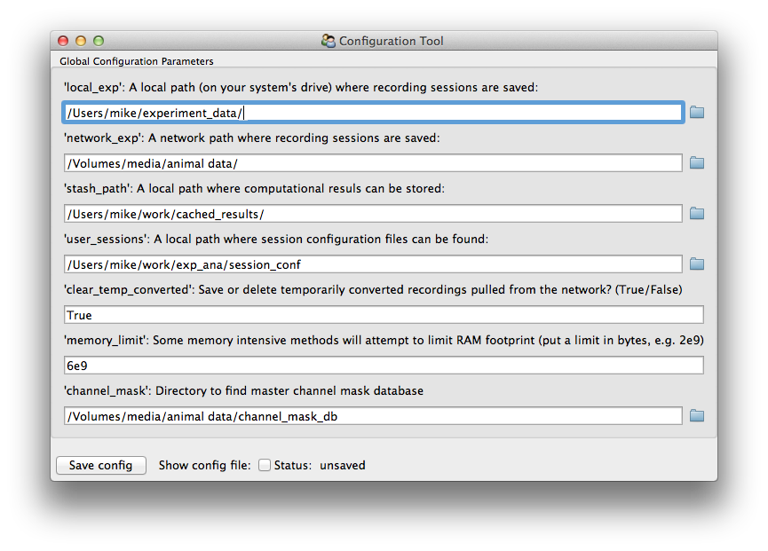

First steps an ecog computing "environment"
===========================================

After installation of the Python system of libraries, there are a few more settings to nail down that help with dataset loading and improve code portability.

.. contents:: Intro topics
   :local:

.. _user_config_info:

User configuration file 
------------------------

Some information--mostly filesystem paths--are needed by multiple components in ecoglib and ecogana.
This config file should be found in ``~/.mjt_exp_conf.txt`` (where ``~/`` refers to the user directory in Unix).
This location can be mysterious in Windows, so the ``config_tool.py`` is recommended.
This is found in ``ecogdata/scripts/config_tool.py`` and should also be found on the command path after installing. 

   
   Image of ``config_tool.py`` window

The config file is **mainly used to define paths**. For any ecog-Python setup you manage, it is important to **always define** these paths.

+ Recording file/config paths:

   -  Two recording paths defined: ``local_exp`` and ``network_exp``
   -  Under "auto" loading, if a recording is not found on local path, it will be searched for in the network path.
   -  The network path is only available if mounted in the file system! (Technically it can be *any* second-choice path.)
   - ``user_sessions``: session config path -- see :ref:`session_config_info` below

+ Other paths for advanced use:

   - ``channel_mask``: channel mask database path
   -  ``stash_path`` : this is used by many analysis scripts as a centralized path to stick caches of computational results. 

+ General configuration settings:

  - ``memory_limit``: Sets a limit for memory consumption for certain operations. Specify in bytes, can be scientific notation (e.g. "6e9").
  - ``floating_point``: Sets the floating point precision for memory mapped files (affects file size by 2X). Choose "double" or "single".

Example config settings:

.. code::

  [globals]
  local_exp = /Users/mike/experiment_data/
  memory_limit = 6e9
  local_proj = /Users/mike/work/exp_ana/
  channel_mask = /Volumes/media/animal data/channel_mask_db
  network_exp = /Volumes/media/animal data/
  user_sessions = /Users/mike/work/exp_ana/session_conf
  clear_temp_converted = True
  stash_path = /Users/mike/work/cached_results/
  floating_point = double

.. _global_config_override:

The global parameters can also be over-ridden at runtime either temporarily or for the duration of the process. Use this example:

>>> from ecogdata.expconfig import load_params, OVERRIDE                                                                                                                                                       
>>> load_params().user_sessions                                                                                                                                                                                
'/Users/mike/work/sessions'
>>> OVERRIDE['user_sessions'] = '/Users/mike/alternate_database'                                                                                                                                               
>>> load_params().user_sessions                                                                                                                                                                                
'/Users/mike/alternate_database'
>>> del OVERRIDE['user_sessions']                                                                                                                                                                              
>>> load_params().user_sessions                                                                                                                                                                                
'/Users/mike/work/sessions'

  
.. _session_config_info:

Session configuration files
---------------------------

The experiment session config files are used to assist loading and interpreting recordings (see :doc:`dataset demo notebook <dataset_demo_py3>`).
You must maintain a local directory with the following structure

::

    group_a/
        config_a1.txt
	config_a2.txt
	resource.txt
    group_b/
        config_b1.txt

In code, sessions are referrenced as ``'group_a/config_a1'`` (always with the forward slash, even on Windows).
Spaces and strange characters in path names are untested and generally should be avoided.
Addition resources are commonly linked to by the config files.
They should be available either in the session path, or in the same directory as the config file itself (e.g. ``resource.txt``).

Here is an example named ``froemke/2015-08-11_conf.txt`` that describes several recordings made during auditory stimulation.

::

    [session]
    exp_path: %(local_exp)s/2015-08-11_Froemke_Lab 
    nwk_path: %(network_exp)s/2015-08-11 Froemke Lab _08112015
    electrode: psv_61_15row
    headstage: mux6
    [DEFAULT]
    bnc : 1
    tone_onset: 0.2
    tone_width: 0.05
    tones_tab: freq_0.5oct_13stim_rot.txt
    amps_tab: 70

    [initial placement]
    [initial_placement2]
    [homecage_anesthetized]

These config files are written to be parsed by `configparser <https://docs.python.org/3/library/configparser.html>`_ from the Python standard library.
There are ``[sections]`` and there are ``parameters : value`` pairs.
Two sections should always be defined:

``[session]`` -- contains info regarding recording, including

-  path(s) to find the recordings: ``exp_path`` and/or ``nwk_path``

   + Paths can be absolute, but in this case notice that they reference variables set in the "global" config file.
     This makes config files portable between machines.

-  ``headstage`` name -- this will switch which loading method to use
-  ``electrode`` name -- this will be used with :py:mod:`ecogdata.devices.electrode_pinouts` to find the correct channel map
- For other data acquisition systems, further arguments may be required such as ``daq`` for active electrodes.

``[DEFAULT]`` -- info regarding experiment setup. The examples here are

-  ``bnc``: in this case, stim audio was recorded on BNC chan 1 (counting from zero)
-  tone shape parameters (``tone_onset`` and ``tone_width``)
-  ``tones tab``: this points to a text table defining the pitch sequence
-  ``amps tab``: in this case, it is a single entry (otherwise it can be a sequence ``10, 20, 30``, or another table file ``amps.txt``)

Recordings with external stimulation
++++++++++++++++++++++++++++++++++++

Use subsequent named sections (like ``[initial_placement]``) to indicate the path name of recordings that occurred during external stimulation stimulated.
Named recordings trigger the generation of an object that describes the timing and conditions of the experiment (see :py:class:`ecogdata.expconfig.exp_descr.base_exp.StimulatedExperiment` description).
That object gets attached to the "Bunch" container that holds the loaded dataset as a ``.exp`` attribute.

In the parsed config file, each of these subsections inherit all the parameters from ``[session]`` and ``[DEFAULT]``.
**Note** that *any* of the previously defined fields (notably ``tones_tab`` or ``amps_tab`` can be over-ridden within each named section, such as

::

    [homecage_anesthetized]
    tones_tab : alternate-table.txt
    electrode : other-electrode-name

Other config file tricks
++++++++++++++++++++++++

Many of the parameters/values in a config are literally translated to arguments for the underlying data loading method (see :doc:`dataset demo notebook <dataset_demo_py3>`).
Here are some examples.

*Switch the default row-multiplexing ordering in an active electrode*

::

    [session]
    exp_path: /%(local_exp)s/2016-04-22_active
    nwk_path: /%(network_exp)s/Viventi 4-22-2016
    headstage: zif26 to 2x uhdmi
    daq: 2t-as daq v1
    bnc: 10, 11
    electrode: actv_64
    row_order = 0, 1, 2, 3, 4, 5, 6, 7

*Set resample rate to 2 kS/s and store the downsampled raw data in the local experiment path*

::

    [session]
    exp_path: %(local_exp)s/2016-07-19_panasonic
    nwk_path: %(network_exp)s/Viventi 2016-07-19 Acute
    headstage: oephys
    trigger_idx: 0
    electrode: psv_61_intan
    useFs: 2000
    store_path: %(exp_path)s
    rec_num = 100

**Also note** that any of these parameters can also be set on a per-recording basis in the corresponding named section.

